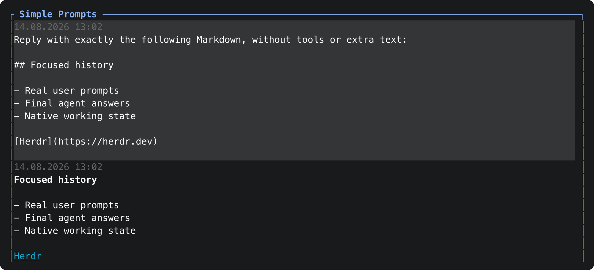

# Herdr Simple Prompts

[](https://github.com/AlexSamarsky/herdr_simple_prompts/actions/workflows/ci.yml)
[](LICENSE)


Simple Prompts is a focused full-pane view for [Herdr](https://herdr.dev). It
keeps real user prompts, final Codex or Claude answers, native `Working` status,
and a capable composer visible while hiding reasoning, commentary, tool traffic,
system context, and subagent noise.



Version 0.1 supports Codex CLI and Claude Code on macOS and Linux.

## Why Simple Prompts?

Native agent panes are excellent work logs, but their reasoning and tool output
can make it hard to reread the actual conversation. Simple Prompts gives each
session a calm transcript without replacing the agent or modifying its native
history:

- user prompts appear as clear full-width blocks;
- only final agent answers enter the conversation history;
- the live native `Working` state and blocked interactions remain available;
- the editor supports multiline input, images, and compact large-paste tokens;
- `prefix+m` switches back to the unchanged native pane at any time.

## Quick start

### Requirements

- Herdr 0.7.5 or newer
- Rust 1.85 or newer with Cargo
- Codex CLI or Claude Code
- the corresponding Herdr native integration

Install the plugin directly from its public source repository:

```bash
herdr plugin install AlexSamarsky/herdr_simple_prompts
```

Install the integration for the agent you use:

```bash
herdr integration install codex
# or
herdr integration install claude
```

Add the toggle to `~/.config/herdr/config.toml`:

```toml
[[keys.command]]
key = "prefix+m"
type = "plugin_action"
command = "herdr.simple-prompts.toggle"
description = "Toggle Simple Prompts"
```

Reload Herdr, focus a Codex or Claude pane, and press the Herdr prefix (normally
`ctrl+b`) followed by `m`:

```bash
herdr server reload-config
```

Press `prefix+m` again to return to the unchanged native agent pane.

## Existing sessions

Sessions started before their Herdr integration was installed may not yet have
native session metadata, so the hotkey cannot target them safely. This
repository includes an optional, fail-closed recovery helper for already-running
panes. It requires `jq` and `rg` in addition to Herdr.

Clone the exact source, inspect the helper, then run it:

```bash
git clone https://github.com/AlexSamarsky/herdr_simple_prompts.git
cd herdr_simple_prompts
sed -n '1,240p' scripts/register-existing-sessions.sh
bash scripts/register-existing-sessions.sh
```

The helper changes only unregistered Codex panes whose final visible footer has
one unambiguous session identifier and exactly one matching local transcript.
It never reads transcript contents or prints identifiers. Already registered
panes are unchanged. Claude panes without metadata are skipped because their
session identifier cannot currently be recovered with the same guarantees;
restart or resume those panes after installing the Claude integration.

## Source-only trust model

This repository does not publish or download executable plugin binaries. Herdr
clones the public source and runs this visible build command locally:

```bash
cargo build --locked --release
```

`Cargo.lock` fixes the complete dependency graph. The plugin has no HTTP client,
telemetry, analytics, update checker, or runtime network access. Cargo still
needs access to crates.io during the first local build unless the locked crate
sources are already cached.

Herdr displays the manifest and build command in its trust preview before
building. Confirm the plugin is available:

```bash
herdr plugin list --plugin herdr.simple-prompts
```

## Exact pane targeting

Simple Prompts opens as a targeted zoomed plugin pane next to the exact source
pane and immediately fills that source tab. This uses Herdr's explicit
`target_pane_id` path, so a concurrent focus change cannot move the view to a
different pane. Closing Simple Prompts removes its temporary split and restores
the original source layout.

The `zoomed` placement is intentional. Herdr 0.7.5 overlays target the active
pane and reject `target_pane_id`, which would reintroduce a cross-pane focus
race. See the official [plugin pane documentation](https://herdr.dev/docs/plugins/#panes).

`prefix+p` is intentionally not used because Herdr assigns it to the previous
tab by default.

## Conversation view

History is laid out once by a Unicode-aware visual-row engine. The same rows
drive rendering, bottom alignment, scrolling, and sticky prompt context, so a
long answer remains reachable instead of being wrapped a second time by the
terminal widget.

- Each user prompt is a full-width neutral-gray block. Its existing top gray
  row shows the prompt's local `DD.MM.YYYY HH:MM` timestamp in undimmed gray,
  and one blank gray row remains below the text. There is no `YOU` label. Legacy
  records without a valid timestamp keep the top row blank.
- Each final answer begins with its local `DD.MM.YYYY HH:MM` timestamp on one
  undimmed gray, unboxed row on the normal terminal surface, followed
  immediately by the styled answer text. There is no `ANSWER` label or answer
  box. Legacy records without a valid timestamp add no metadata row or empty
  gap.
- After a prompt scrolls out of its natural position, at most its first two
  wrapped content rows stay at the top. The gray top padding stays with them
  when the viewport has room. The next prompt pushes the old block away one row
  at a time. The sticky copy never replaces or truncates the complete prompt in
  ordinary history.
- `PageUp` and `PageDown` scroll the conversation. Returning the offset to the
  bottom resumes live bottom-following.

Drag across text and release the mouse to use Herdr's native selection and
automatic copy behavior. Simple Prompts deliberately leaves mouse capture off;
OSC 8 links remain clickable through the terminal or Herdr.

For every final answer, the transcript's `Message.text` remains the
canonical Markdown value used for identity and replay. Simple Prompts separately
projects that Markdown into the visible text a terminal renderer shows:
supported heading, emphasis, inline-code, and fenced-code delimiters are
removed. A Markdown `http://` or `https://` link is shown as a cyan, underlined
label without the visible destination and is clickable in terminals that
support OSC 8. Other syntactically valid schemes are shown as ordinary labels;
malformed syntax remains literal.

For a newly observed final answer, Simple Prompts reads recent ANSI output from
the source agent and accepts a styled block only when its sanitized visible text
exactly matches that deterministic projection at one unique known Codex or
Claude final-answer boundary. The captured presentation owns both the visible
text and safe SGR colors, bold, dim, italic, and underline styles. Cursor
movement, alternate-screen commands, OSC titles, hyperlinks, clipboard
commands, and other terminal controls are discarded and never replayed. Any
clickable link is rebuilt only from the canonical, control-free HTTP(S)
Markdown destination after the visible text matches exactly; a captured OSC
sequence can never become link metadata. For a syntactically valid but
non-clickable destination, only a captured underline on that label is removed;
unrelated native color and emphasis remain unchanged.

When exact native ANSI is unavailable, the same dependency-free projected text
is shown with deterministic fallback styles. Captured native visible text and
styles are saved together in the pane/session journal; older version-1 journal
records remain readable and are downgraded to fallback when their legacy style
offsets cannot safely describe the new visible projection.

## Composer keys

| Key | Action |
|---|---|
| `Enter` | Submit the prompt |
| `Shift+Enter` | Insert a newline when supported by the terminal |
| `Ctrl+J` | Portable newline fallback |
| `Ctrl+V` | Attach an image through the native agent |
| `Esc` | Interrupt the agent while it is working |
| `PageUp` / `PageDown` | Scroll conversation history |

Pastes below 1,000 characters remain directly editable. A paste of 1,000
characters or more appears as one atomic `[Pasted Content · N chars]` token in
the composer and prompt history, while Codex or Claude receives the complete
original text with all newlines. Multiple large pastes remain separate; the
cursor skips each token and deletion removes it as a whole. The plugin imposes
no arbitrary prompt-length truncation. Any Herdr or agent-side rejection is
shown and the exact draft, including the hidden source behind compact tokens,
is restored.

## Native composer protection

Simple Prompts keeps its editor separate from the native Codex or Claude
composer. Before editing and again immediately before submission, it checks the
recognized native composer surface:

- unsent native text disables Simple Prompts editing/submission and asks you to
  press `prefix+m`; both the native draft and the complete plugin draft remain
  unchanged;
- native image placeholders are accepted only when their count exactly matches
  images attached by Simple Prompts;
- an unrecognized or incomplete composer layout is blocked conservatively
  instead of guessing that it is empty.

The check returns only a coarse state and attachment count. Native draft text
and native attachment paths are never copied into plugin state, the history
journal, logs, or error messages.

Herdr 0.7.5 does not provide one atomic "inspect and submit" operation. The
authoritative final preflight prevents the reported single-client draft
concatenation path, but cannot guarantee atomicity if another client writes to
the native composer between that read and `agent.prompt`.

## Native questions and approvals

When Herdr reports that the source agent is blocked, Simple Prompts temporarily
shows `INTERACTION REQUIRED` and a refreshed, sanitized view of the native
Codex or Claude question, choice, permission, or approval surface. Conversation
history and the composer are hidden during this mode, but their contents remain
unchanged and return automatically when the agent leaves the blocked state.

Typed text and pasted text are forwarded to the native surface. These native
keys are supported: `Up`, `Down`, `Left`, `Right`, `Tab`, `Shift+Tab`, `Space`,
`Enter`, `Backspace`, `Delete`, and `Esc`. Each accepted input is sent once;
unsupported control keys are ignored. Mouse interaction is not mapped in
version 0.1.

If the native interaction cannot be read, Simple Prompts shows an error instead
of guessing the question or its answer. Press `prefix+m` to close Simple Prompts
and answer directly in the unchanged native pane.

## Images and remote attach

For local sessions, `Ctrl+V` is forwarded to the native Codex or Claude composer.
The view records the attachment only after the native pane exposes its image
marker.

During remote attach, Herdr stages a locally pasted image in its private remote
temporary directory and pastes the path. Simple Prompts recognizes only an
existing image file under a `herdr-clipboard-images-*` path and forwards it to
the native agent. Images appear as compact `[Image #N]` placeholders; the plugin
does not render or copy their pixels.

## Privacy and state

Simple Prompts never modifies the native Codex or Claude transcript. It does
keep an intentional private copy of the visible prompt/final-answer subset so
reopening the view can reproduce what it previously showed. This is scoped
to one source pane and one native session; it is not a global conversation
database or cross-pane browser.

The Herdr-managed state directory contains:

- the source-to-plugin-pane registry;
- the current draft and local attachment placeholders;
- compact-paste display ranges, character counts, and integrity fingerprints;
- the pane/session visible-history journal.

The journal is auditable JSON Lines at:

```text
history/<safe-source-pane-id>/<native-session-id>.jsonl
```

Each versioned record contains only a display-safe user prompt or visible final
answer, its native stable and turn identifiers, sanitized attachment labels,
attachment IDs, timestamp and display order, a text fingerprint, and either
validated native style ranges or fallback/plain presentation provenance. A
repeated stable id is an append-only upsert whose latest valid record wins, so
later exact native ANSI can replace fallback presentation.

Prompt and final-answer timestamps were already present in the journal before
their date/time rows were added, so existing history needs no migration.

The journal never stores reasoning, commentary, tool calls or results, system
context, subagent traffic, blocked interaction surfaces, native attachment
paths, or the hidden body of a large paste. A submitted large paste is copied to
history only as its compact marker. Only an unsent draft may retain the complete
hidden paste so editing and send-failure recovery stay lossless.

State directories use mode `0700`; registry, draft, namespace, and journal files
use mode `0600`. Journal writes are asynchronous, append newline-terminated
records, and ignore an incomplete final line during recovery.

State retention follows the source pane rather than the Simple Prompts view:

| Event | Result |
|---|---|
| Close only Simple Prompts with `prefix+m` | Keep the pane/session history and draft for reopening |
| Close the native source pane | Delete that pane's registry, draft, compact metadata, and history namespace |
| Reuse a pane for a different native session | Delete the replaced session's saved state during validation |
| Source cannot be verified temporarily | Keep its state; after seven continuously unverifiable days, remove it on the next plugin invocation |

Before every prompt, interrupt, image mutation, or blocked-input forwarding, the
plugin verifies that the source pane still contains the original agent kind and
native session id. No detached cleanup watcher or resident plugin daemon is
created.

## Local development

```bash
git clone https://github.com/AlexSamarsky/herdr_simple_prompts.git
cd herdr_simple_prompts
cargo test --all-targets --all-features
cargo build --locked --release
herdr plugin link .
```

Edits remain in the local checkout. Rebuild and relink as needed; unlinking does
not delete source files:

```bash
herdr plugin unlink herdr.simple-prompts
```

## Verification

```bash
cargo fmt --check
cargo clippy --all-targets --all-features -- -D warnings
cargo test --all-targets --all-features
cargo build --locked --release
```

CI runs the source build on macOS and Linux and uploads no executable artifact.

## Manual Codex and Claude smoke test

Build and link the current source, then install both native integrations:

```bash
cargo build --locked --release
herdr plugin link .
herdr integration install codex
herdr integration install claude
herdr server reload-config
```

For Codex, focus a current native Codex pane and press `prefix+m`. Verify this
sequence with synthetic, non-sensitive input:

1. Submit a normal prompt and confirm it appears above the native `Working` row
   as a full-width gray block with local `DD.MM.YYYY HH:MM` in its top gray row
   and one blank gray row below, without `YOU` or `ANSWER` labels.
2. Request a long final answer containing a Markdown heading, bold and
   emphasized text, inline code, fenced code, and a Markdown link. Compare the
   native pane with Simple Prompts: confirm one undimmed gray local timestamp
   row appears immediately above the answer without background fill or a box;
   the same visible words appear in the same order; supported delimiters and the
   link destination are absent; native colors and emphasis remain when exact
   capture succeeds; the link label opens its HTTP(S) destination in an OSC
   8-capable terminal; and the last line is reachable by scrolling. Also
   confirm a `mailto:` fixture remains an ordinary non-clickable label,
   `PageUp`/`PageDown` scroll, native drag-and-release selection automatically
   copies, and the first two prompt rows stick and are pushed away by the
   following prompt.
3. Paste 1,000 or more characters. Confirm the composer and saved prompt show
   only the compact marker while the native agent receives the complete text.
4. Use a workflow that asks a question or permission. Confirm
   `INTERACTION REQUIRED`, exercise the supported keys, and confirm the
   unchanged draft returns afterward.
5. Close and reopen only Simple Prompts with `prefix+m`; confirm the exact
   rendered text and styles from step 2 are restored. Then close the native
   source pane and confirm its private pane state is removed.
6. Type synthetic text in the native composer without submitting it, open Simple
   Prompts, and confirm editing is blocked without changing either draft. Clear
   the native draft and confirm one subsequent submission produces one prompt.
7. Remove an open Simple Prompts pane, then press `prefix+m` from that stale
   action context and confirm one invocation targets the still-live source and
   opens a replacement view on the original source tab.

Repeat steps 1, 2, 4, 5, and 6 in a current Claude Code pane. Include one
tool-using prompt and confirm thinking, tool use/results, and progress remain in
the native pane while only the final visible answer appears in Simple Prompts.
If no live Claude session is available, report that prerequisite as missing;
the automated Claude fixtures do not constitute a live smoke test.

## Troubleshooting

### Native session is unavailable

Install the corresponding Herdr integration and restart the agent pane:

```bash
herdr integration install codex
# or
herdr integration install claude
```

For already-running Codex panes that predate the integration, use the audited
recovery helper from [Existing sessions](#existing-sessions). It deliberately
skips any pane that cannot be identified unambiguously. Restart or resume a
skipped pane after installing its integration.

### `prefix+m` does not open Simple Prompts

Confirm the binding is present, then reload Herdr configuration:

```bash
herdr server reload-config
```

If the plugin action log reports `pane_not_found` for a removed Simple Prompts
pane, press `prefix+m` again. Simple Prompts now validates the mapped source,
removes only the stale source/plugin-pane pair, and targets a replacement view
to that source in the same toggle invocation. Temporary permission, transport,
or timeout errors preserve the mapping for a later retry.

### An image is not attached

Open the native agent pane and confirm its own image paste works first. Simple
Prompts deliberately reports failure when the native attachment marker cannot be
verified.

### Status fields are missing

Model and usage parsing is conservative. When a new agent version changes its
footer, Simple Prompts omits unproven fields instead of inventing values. The
agent kind and known working directory remain visible.

### Uninstall

```bash
herdr plugin uninstall herdr.simple-prompts
```

## Limitations

- Only Codex and Claude are supported in version 0.1.
- Clickable labels require OSC 8 support in the terminal emulator; unsupported
  terminals still show the same cyan, underlined HTTP(S) label as plain styled
  text.
- Windows is not supported.
- The view belongs to the currently focused native session; it is not a global
  conversation browser.
- Image pixels are not rendered inside the Simple Prompts view.
- Agent footer extraction is best-effort and intentionally conservative.

## Publishing to the Herdr marketplace

Make the GitHub repository public and add the `herdr-plugin` repository topic.
Herdr's marketplace discovers public repositories with that topic automatically.

## License

MIT
